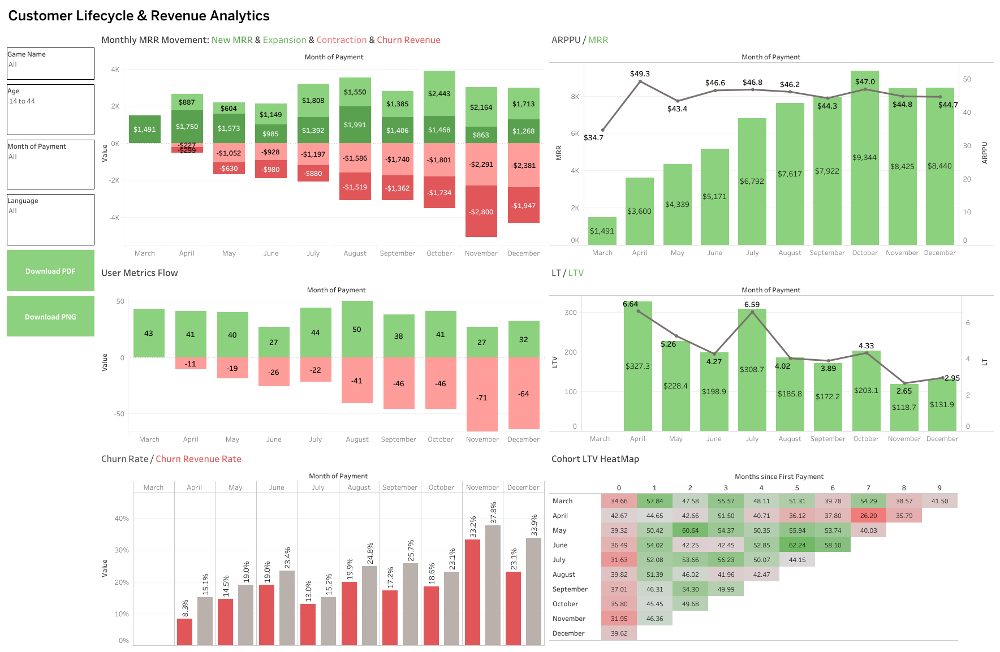
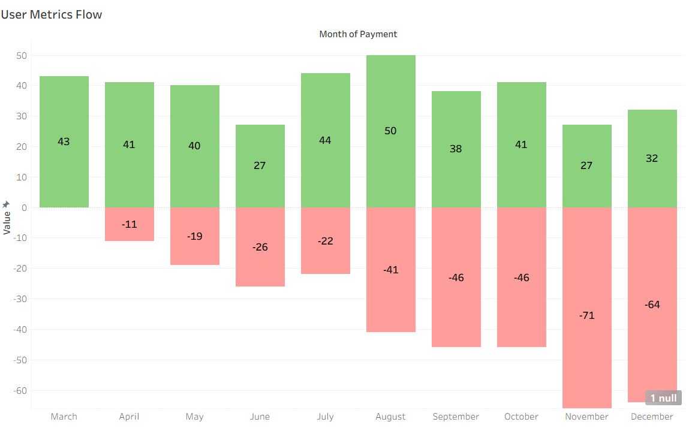
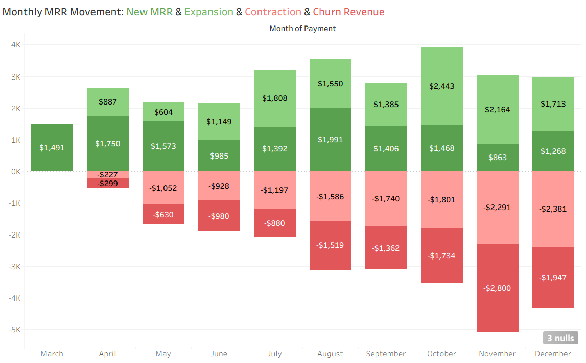
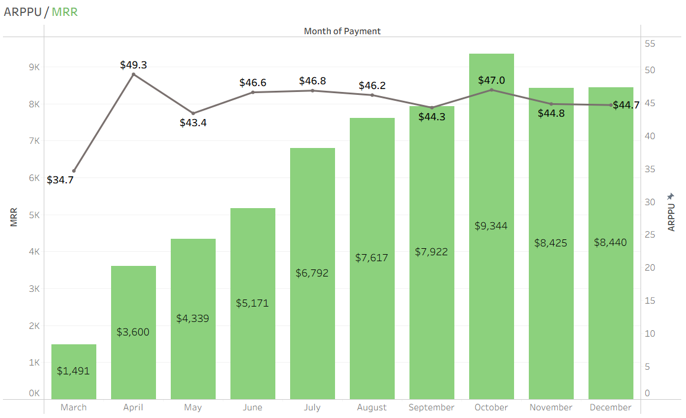
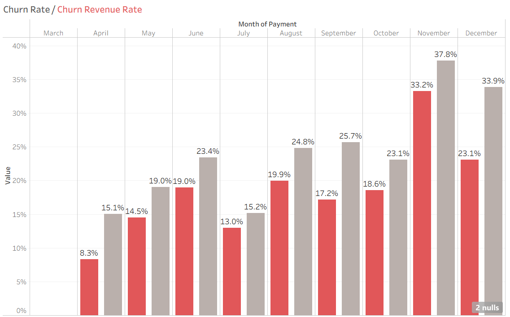
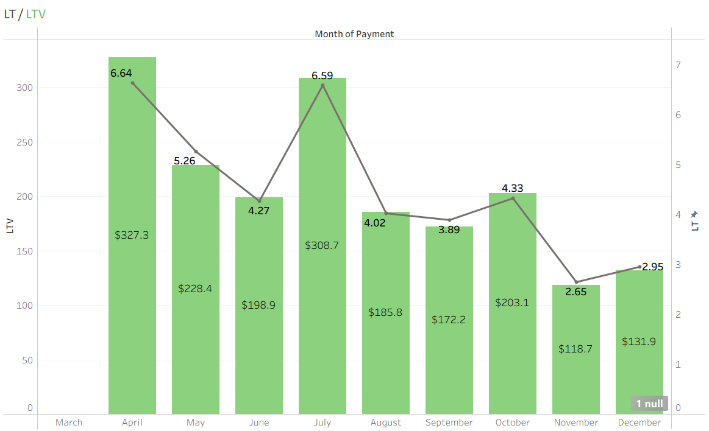
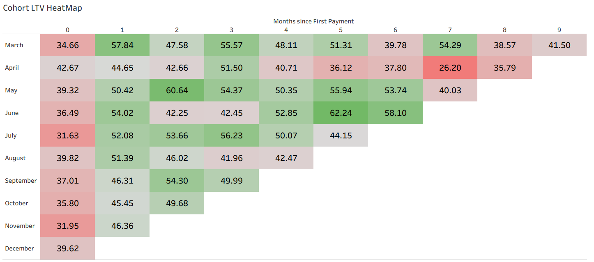

# Customer Lifecycle & Revenue Analytics

This project analyzes customer lifecycle, revenue growth, and churn dynamics using key SaaS metrics.
The goal of the analysis is to understand how user behavior affects revenue performance, identify churn risks, and highlight opportunities for improving customer lifetime value.

The dashboard visualizes monthly trends and allows segmentation using interactive filters.

Filters available in the dashboard:
- Language
- Age group
- Game title
- Payment month

Dashboard Overview

🔗 Interactive Dashboard: https://public.tableau.com/app/profile/anastasiia.voitsitska/viz/CustomerLifecycleRevenueAnalytics/Dashboard1

The dashboard consists of several analytical blocks that explain user growth, revenue movement, and long-term customer value.

## 1. User Metrics Flow

This section shows the relationship between new paying users and churned users over time.

### Purpose:

- Understand user acquisition trends
- Identify periods with higher churn
- Evaluate whether the platform is growing or losing customers

### Key observation:
The number of paying users grows over time, but churn also increases in later months, which can slow future growth.

## 2. Monthly MRR Movement

This block explains how Monthly Recurring Revenue (MRR) changes over time.

### The chart includes:

- New MRR – revenue from new paying users
- Expansion Revenue – additional revenue from existing users
- Contraction Revenue – revenue decrease from downgraded subscriptions
- Churn Revenue – revenue lost due to cancellations

### Purpose:

- Identify drivers of revenue growth
- Understand how churn and downgrades affect revenue

## 3. ARPPU & MRR

This section compares Average Revenue Per Paying User (ARPPU) with overall revenue growth.

### Purpose:

- Measure monetization efficiency
- Understand whether the revenue growth is due to an increase in the number of users or an increase in revenue per user.

### Observation:
ARPPU remains relatively stable after the initial growth phase, indicating consistent spending behavior among users.

## 4. Churn Analysis

This section focuses on customer churn and churned revenue.

### Metrics included:

- Churn Rate – percentage of users who cancel subscriptions
- Churn Revenue Rate – percentage of revenue lost due to churn

### Purpose:

- Identify periods with high customer loss
- Understand how churn affects revenue stability

### Observation:
Churn rate increases in later months, which creates growing pressure on revenue retention.

## 5. Lifetime Value Analysis

This block explores the relationship between:

- Customer Lifetime (LT)
- Customer Lifetime Value (LTV)

### Purpose:

- Measure long-term value generated by each user
- Evaluate the sustainability of revenue growth

### Observation:
Shorter customer lifetime leads to lower lifetime value, highlighting the importance of retention strategies.

## 6. LTV Heatmap

The heatmap shows LTV across different user segments.

Users can analyze patterns by:

- Device language
- Age group
- Game title
- Payment month

### Purpose:

- Identify high-value customer segments
- Support targeted marketing and retention strategies.

### Key Metrics Used

The analysis is based on common SaaS and subscription business metrics:

- Monthly Recurring Revenue (MRR)
- New MRR
- Expansion Revenue
- Contraction Revenue
- Churn Revenue
- ARPPU
- Churn Rate
- Churn Revenue Rate
- Customer Lifetime (LT)
- Customer Lifetime Value (LTV)

## Business Insights

Based on the analysis, several patterns can be observed:

1. Revenue growth is primarily driven by new users.
New MRR plays a significant role in total revenue growth, indicating strong acquisition performance.

2. Expansion revenue contributes positively but inconsistently.
Some months show strong expansion revenue, suggesting opportunities for upselling existing users.

3. Churn increases over time.
Rising churn rates reduce long-term revenue potential and decrease customer lifetime value.

4. Customer lifetime is gradually decreasing.
This leads to a decline in overall LTV, meaning that users generate less revenue during their relationship with the product.

## Recommendations

Based on the findings, several actions could improve revenue performance:

1. Improve user retention strategies

- Introduce loyalty programs
- Offer personalized offers for active users
- Improve onboarding experience

2. Focus on high-value user segments

- Use heatmap insights to identify segments with higher LTV
- Target these users with premium offers or additional content

3. Increase expansion revenue

- Implement cross-sell and upsell opportunities
- Promote premium features to existing users

4. Monitor churn signals

- Identify behavioral patterns that precede cancellations
- Introduce proactive retention campaigns.
